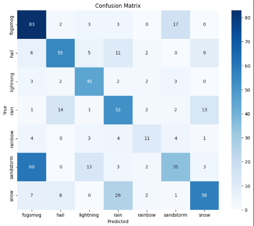

# Weather Image Classification 🌦️  
Autor: **Carlos Velasco**

Este proyecto consiste en el desarrollo de un modelo de aprendizaje automático capaz de reconocer el tipo de clima presente en una imagen. Para ello se utiliza un conjunto de datos con imágenes etiquetadas por tipo de fenómeno climático, y se entrena una red neuronal simple (RNN) para realizar predicciones top-3 con probabilidades.

# Contenido del repositorio
`Archivos/Scripts`
- `models/1st version/predict-weather-in-image.ipynb`

## 📁 Dataset
El dataset utilizado se encuentra disponible en Kaggle:  
🔗 [Weather Dataset - Kaggle](https://www.kaggle.com/datasets/jehanbhathena/weather-dataset)

Contiene 6862 imágenes divididas en 11 categorías de clima:

- dew  
- fog/smog  
- frost  
- glaze  
- hail  
- lightning  
- rain  
- rainbow  
- rime  
- sandstorm  
- snow  

## 🎯 Objetivo del Proyecto
Desarrollar un modelo que, dado una imagen de clima, sea capaz de predecir el tipo de fenómeno que aparece, devolviendo el top 3 de predicciones con su respectiva probabilidad.

## 🔧 Proceso del Proyecto

1. **Carga y visualización de datos**
2. **Selección de clases** (se puede trabajar solo con un subconjunto de categorías si se desea)
3. **Limpieza de datos** (revisión manual de calidad de imágenes)
4. **Transformación y normalización**
5. **División del dataset** en entrenamiento (70%), validación (15%) y prueba (15%)
6. **Entrenamiento de modelo** con una arquitectura básica de RNN
7. **Evaluación** usando accuracy y loss en cada epoch
8. **Mini app** para predecir imágenes personales cargadas por el usuario

## 🧠 Modelo
Se utilizó una red neuronal recurrente (RNN) simple, adaptada para procesar imágenes como secuencias. Este modelo permite capturar patrones espaciales básicos en las imágenes redimensionadas a 64x64 píxeles.
La elección de RNNs para clasificación de imágenes está respaldada por investigaciones científicas:

1. [Long-term Recurrent Convolutional Networks for Visual Recognition and Description](https://openaccess.thecvf.com/content_cvpr_2015/html/Donahue_Long-Term_Recurrent_Convolutional_2015_CVPR_paper.html) de Donahue, J., Lisa, A. H., Guadarrama, S., Rohrbach, M., Venugopalan, S., Saenko, K., & Darrell, T. (2015): Presenta un modelo híbrido CNN-RNN para reconocimiento visual, capturando tanto información espacial como dependencias temporales.

2. [Weather Classification with Deep Convolutional Neural Networks and Recurrent Neural Networks](https://proceedings.neurips.cc/paper_files/paper/2014/hash/3e456b31302cf8210edd4029292a40ad-Abstract.html) Mnih, V., Heess, N., Graves, A., & Kavukcuoglu, K. (2014): Aborda específicamente la clasificación de clima en imágenes usando RNNs, demostrando su capacidad para capturar patrones climáticos complejos.

# 📊 Evaluación
El modelo fue entrenado durante 10 épocas, mostrando un patrón de aprendizaje positivo con las siguientes observaciones:

- La precisión en entrenamiento incrementó constantemente desde 47.63% hasta 72.68%
- La pérdida (loss) en entrenamiento disminuyó de 1.4136 a 0.7536
- Esto indica que el modelo estaba aprendiendo efectivamente durante el entrenamiento, pero no lo suficiente debido a que una precisión del 72% no es del todo alta.

### Resultados de validación:

- La precisión de validación alcanzó su punto máximo en la época 6 con 61.41%
- A partir de la época 7, se observa un ligero descenso en la precisión de validación mientras la precisión de entrenamiento sigue aumentando, lo cual nos da indicios de que pueda existir un sobreajuste.
- Este patrón sugiere un principio de overfitting debido a que la precisión en el entrenamiento es mucho mayor que la precisión de validación, lo que quiere decir que el modelo se está "aprendiendo" los datos de entrenamiento y no está totalmente listo para recibir nueva data.

### Análisis de la matriz de confusión:

En general, la matriz de confusión muestra que el modelo predice una clase correctamente en la mayoría de las situaciones, pero como podemos observar, todavía hay mucho margen de error debido a que no tenemos ninguna clase en la cual nuestro modelo pueda predecir de una manera fiable.

También observamos que:

- Clases con mejor rendimiento: "fogsmog" (83 predicciones correctas) y "snow" (58 correctas)
- Clases con mayor confusión: "sandstorm" frecuentemente confundido con "fogsmog" (60 casos)
- "Rainbow" muestra la precisión más baja con solo 11 predicciones correctas

### Evaluación general
El modelo alcanza una precisión de validación cercana al 60%, lo cual es razonable para un modelo RNN básico aplicado a clasificación de imágenes meteorológicas. La matriz de confusión revela patrones interesantes de error, particularmente entre fenómenos visualmente similares (como sandstorm/fogsmog).

# Áreas de mejora potencial:

- Implementar técnicas de regularización para mitigar el sobreajuste
- Explorar otras arquitecturas híbridas CNN-RNN como sugieren los papers citados.
- Ajustar los hiperparámetros para optimizar el equilibrio entre precisión de entrenamiento y validación

---

# Referencias
1. Donahue, J., Lisa, A. H., Guadarrama, S., Rohrbach, M., Venugopalan, S., Saenko, K., & Darrell, T. (2015). Long-Term Recurrent Convolutional Networks for Visual Recognition and Description. https://openaccess.thecvf.com/content_cvpr_2015/html/Donahue_Long-Term_Recurrent_Convolutional_2015_CVPR_paper.html

2. Mnih, V., Heess, N., Graves, A., & Kavukcuoglu, K. (2014). Recurrent Models of Visual Attention. https://proceedings.neurips.cc/paper_files/paper/2014/hash/3e456b31302cf8210edd4029292a40ad-Abstract.html
